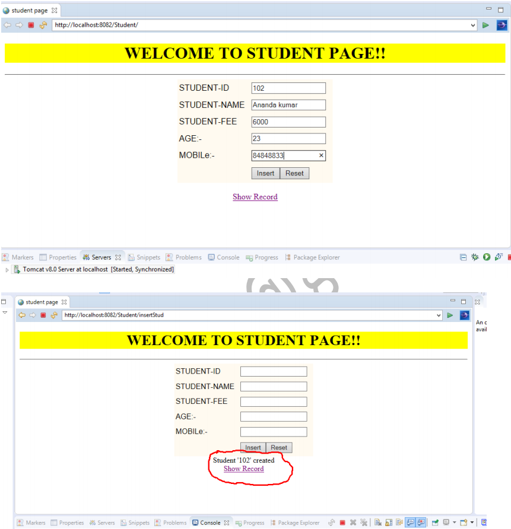
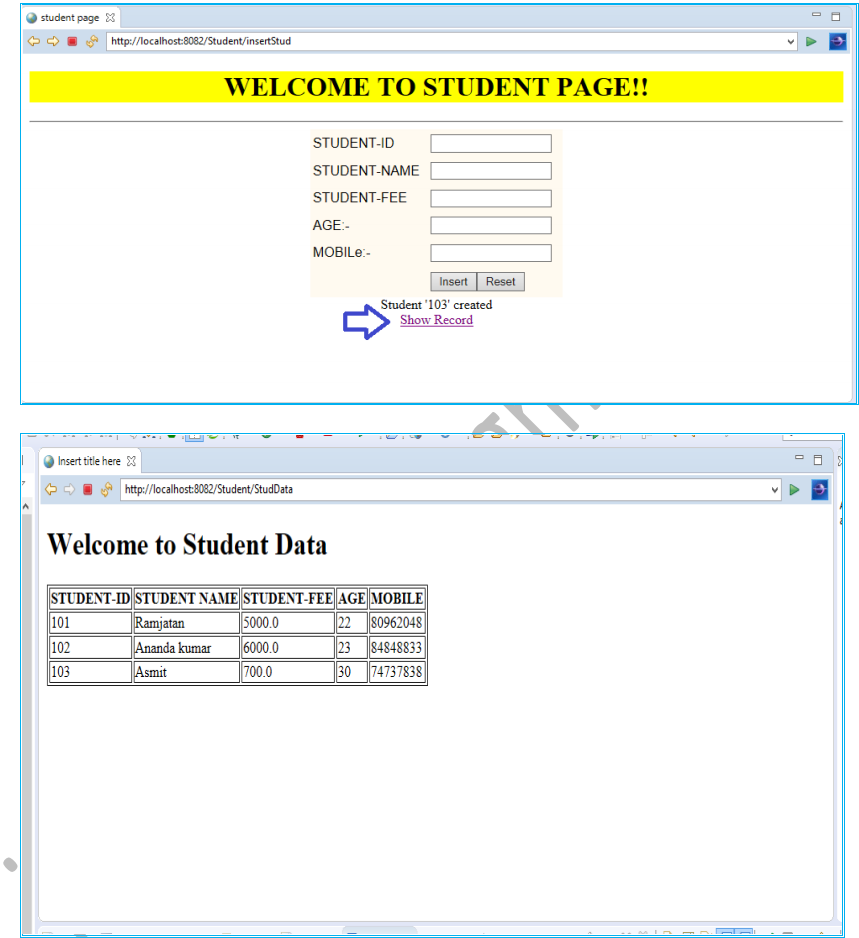

## 🗄️ Hibernate CRUD Application with MySQL                                      
           
This is a simple Java-based CRUD (Create, Read, Update, Delete) application built using **Hibernate ORM** with **MySQL** as the backend database.  
It demonstrates how to perform basic database operations (insert, fetch, update, delete) using Hibernate with proper configurations and JPA annotations.

---           
    
## 📌 Features  
- ✍️ Create a new record in the database  
- 📖 Read (retrieve) records   
- ✏️ Update existing records  
- ❌ Delete records  
- 🔗 Uses Hibernate ORM for mapping Java objects to database tables  
- 🗄️ MySQL as the backend database  

---   

## 🛠️ Technologies Used
- ☕ **Java 17**  
- 🌀 **Hibernate 6.x**  
- 🗄️ **MySQL 8.x**  
- 📦 **Maven** (dependency management)  
- 🏷️ **JPA Annotations**  

---

## 📸 Screenshot
Insert Data and Save:

All Data :

---

    
## 🔗 Connect with me

 💼 [LinkedIn](https://www.linkedin.com/in/dinkarprasadjava)  |  🐙 [GitHub](https://github.com/DK12345678D) | 📧 [Gmail](mailto:dinkarprasad682@gmail.com) 
 
 ---

